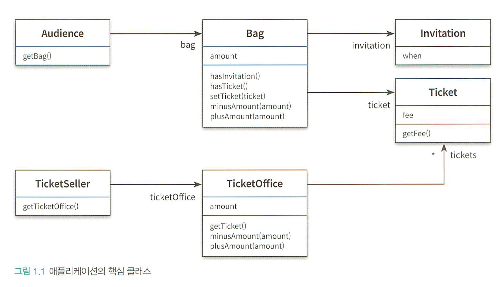
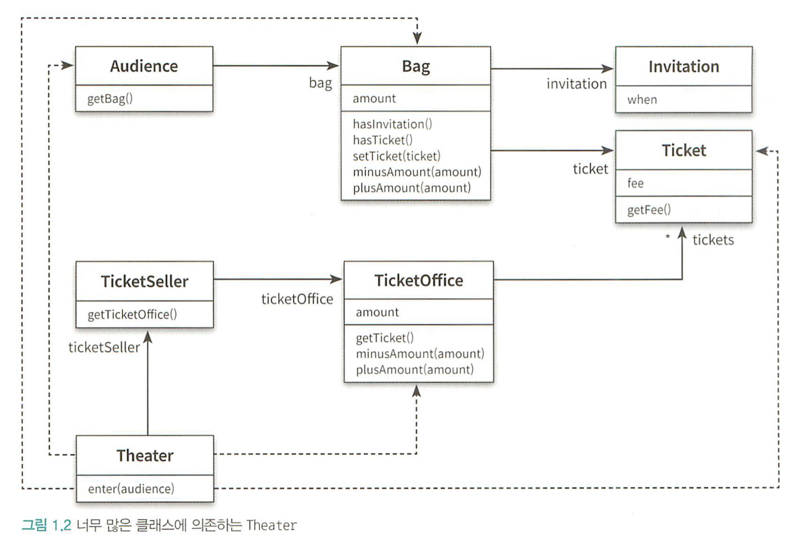
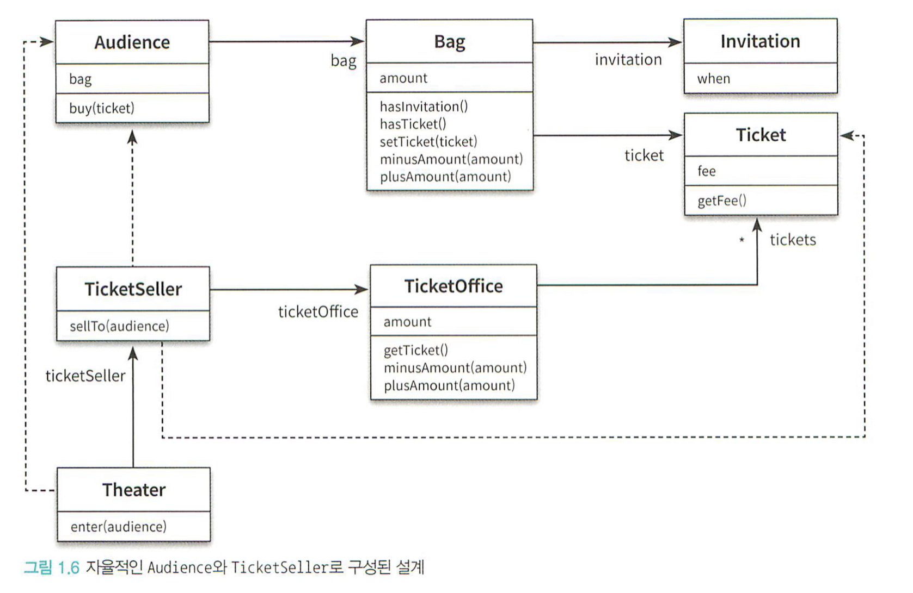
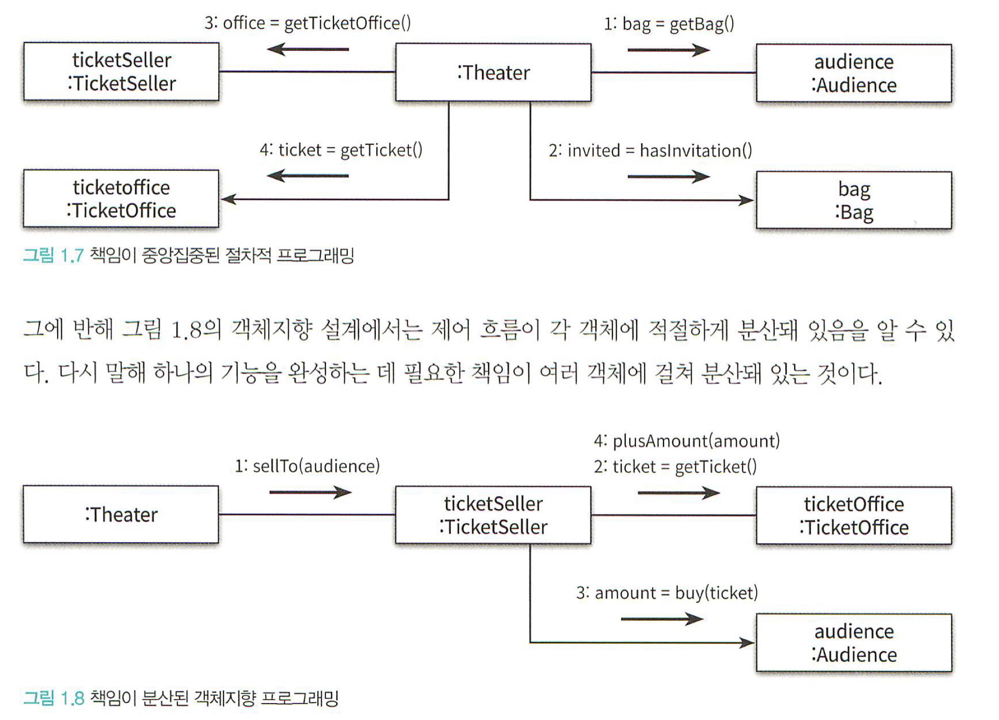

## Chapter 1 - 객체 설계

<p align="center">
<kbd>
</kbd>
</p>

### 소프트웨어 모듈이 가져야 하는 세 가지 기능

1. 실행 중에 제대로 동작해야 한다.
2. 변경에 용이하도록 설계되어야 한다.
3. 코드를 읽는 사람과 의사소통이 가능해야 한다.

### 의존성

어떤 객체가 변경될 떄 그 객체에게 의존하는 객체도 함꼐 변경될 수 있다는 사실이 내포돼 있다. 물론 완전히 의존성을 완전히 없애는 것은 협력하는 객체들간의 공동체를 구축하는 객체지향 설계와는 어울리지 않는다. 따라서 최소한의 의존성만 유지하고, 불필요한 의존성을 제거하는 것을 목표로 해야한다.

<p align="center">
<kbd>
</kbd>
</p>

```typescript
class Theater {

	...
	enter(audience: Audience) {
		const ticket = this.ticketSeller.getTicketOffice().getTicket();
		if (!ticket) {
			return console.error(
				"sorry customer, we have no more ticket to sold"
			);
		}

		if (!audience.getBag().hasInvitation()) {
			audience.getBag().adjustAmount(-1 * ticket.getFee());
			this.ticketSeller.getTicketOffice().adjustAmount(ticket.getFee());
		}

		audience.getBag().setTicket(ticket);
	}
}

```

위의 설계의 문제는 `Teather`객체가 `Audience`객체와 `TicketSeller`객체에 너무 강하게 의존(depend)하고 있다는 점이다. 이러한 경우를 의존성이 과하다 혹은 결합도(couping)이 높다고 말한다. 일례로 위의 코드에서는 `Theater`가 관램객의 가방과 판매원의 매표소에 직접 접근하는데, 이는 각각의 객체가 `스스로` 자신의 일을 처리하는 능동적인 주체라는 전제를 위배한다. 따라서 이러한 객체 사이의 결합도를 낮춰 변경이 용이한 설계를 만들어야 한다. 객체 사이의 결합도를 낮추는 가장 간단한 방법은 각각의 객체를 자율적인 존재로 만드는 것이다.

### 자율적인 존재

<p align="center">
<kbd>
</kbd>
</p>


```typescript
class Theater {
	enter(audience: Audience) {
			this.ticketSeller.sellTo(audience);
		}
}
...

class TicketSeller {
	sellTo(audience: Audience) {
		const ticket = this.ticketOffice.getTicket();
		if (!ticket) {
			return console.error(
				"sorry customer, we have no more ticket to sold"
			);
		}

		if (!audience.getBag().hasInvitation()) {
			audience.getBag().adjustAmount(-1 * ticket.getFee());
			this.ticketOffice.adjustAmount(ticket.getFee());
		}

		audience.getBag().setTicket(ticket);
	}
}

```

**구현과 인터페이스의 분리** : 이렇게 변경된 코드를 살펴보면 `Theater`는 오직 `TicketSeller`의 인터페이스에만 의존하고,`TicketSeller` 내부에서의 구현을 통해 모든 작업을 해결한다. 객체를 인터페이스와 구현으로 구분하여 인터페이스만을 공개하는 것 또한 객체간의 결합도를 낮추는 방법 중 하나이다.

**캡슐화(encapsulation)** : office에 접근해서 티켓을 가져오거나 요금을 관리하는 모든 역할을 접근을 seller 객체 내부에서만 수행한다. 즉, 자신의 역할을 스스로 수행할 수 있는 자율적인 존재로 바뀐 것이다. 이렇게 개념적이나 물리적으로 객체 내부의 세부적인 사항을 감추는 것을 **캡슐화(encapsulation)**이라고 한다. 캡슐화를 통해 객체 내부로의 접근을 제한하면 객체와 객체 사이의 결합도를 낮출 수 있고, 자신과 밀접하게 연관된 작업만을 수행하면서 **응집도(cohesion)**을 높일 수 있다.

> 객체 내부의 상태를 **캡슐화** 하고 객체 간에 오직 **메시지**를 통해서만 상호작용하도록 만들어야 한다.

### 객체지향과 절차지향

Data와 Process가 어디에 위치하느냐에 따라 두 가지 프로그래밍 방법을 나눌 수 있다. 프로세스와 데이터를 별도의 모듈에 위치시키는 방식을 **절차지향(Procedural Programming)**이라고 한다. 반면 데이터(property)와 프로세스(method)가 하나의 모듈 내에서 함께 다뤄지는 경우를 **객체지향(Object-Orineted Programming)**이라고 부른다.

또한 `책임`이라는 관점에서 또한 둘을 나눌 수 있는데, 객체지향의 경우에는 하나의 객체에 하나의 책임이 집중되어 었다.
<p align="center">
<kbd>
</kbd>
</p>


### 정리

올바른 객체지향 설계를 위해서는 불필요한 `의존성`을 줄입으로써 객체 사이의 `결합도`를 낮춰야 한다. 이를 위해 각각의 객체가 자신의 역할을 스스로 해결할 수 있게 `캡슐화`하여 `자율성`과 `응집도`를 높인 객체를 만들어야 한다. 하지만 어떤 기능을 설계하는 것은 한 가지 이상일 수 있다. 따라서 결국 설계는 트레이드오프의 산물이다.

> 설계란 코드를 배치하는 것이다.

설계는 코드를 작성하는 매 순간 코드를 어떻게 배치할 것인지를 결정하는 과정이서 나온다. 오늘 완성해야 하는 기능을 구현하는 코드를 짜야 하는 동시에 내일 쉽게 변경할 수 있는 코드를 짜야 한다.

---

출처 : 오브젝트(코드로 이해하는 객체지향 설계) 조영호 저
